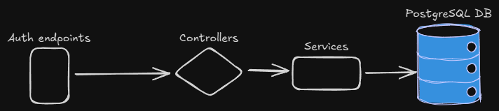

# Backend Authentication App with NestJS and PostgreSQL

This project is a backend application designed as a practical guide for implementing a basic authentication system using NestJS, PostgreSQL, and Docker. It’s ideal for developers looking to learn or integrate a robust authentication structure into their backend projects, following best practices and clean architecture.

## General diagram

## Key Features

- Authentication: Basic credential handling, easily customizable to suit various backends.
- PostgreSQL Integration: Simple connection with a PostgreSQL database to store users and credentials.
- Modular Structure: The authentication system is organized in modules, making it easy to extend and maintain.
- Dockerization: Fully dockerized, allowing easy deployment on any Docker-compatible environment.
- Minimal Setup: Only requires configuring the Docker environment and the PostgreSQL database.
- Route Protection: Implements public and private routes to ensure access is only granted to authenticated users.

## Purpose:

This app is designed to provide a solid foundation for building backend applications with authentication. It’s perfect for developers learning to work with NestJS or those needing a scalable, production-ready authentication system.

With quick setup and Docker integration, it’s ideal for both learning about backend architecture and integrating authentication into larger applications. Just configure the Docker environment variables and adjust the PostgreSQL database, and you’re all set!
